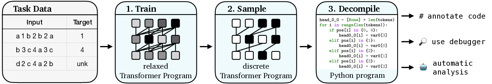

# Learning Transformer Programs (Extended)

This repository extends the original codebase from [Learning Transformer Programs](https://arxiv.org/abs/2306.01128) with modular routing improvements, including:

Prefix Sum Counts – enables positional accumulation and structured token-level aggregation

Mixture of Experts Routing – introduces task-adaptive computation paths via differentiable expert selection

The code supports training modified Transformers to solve a variety of synthetic and NLP tasks, and converts them into interpretable Python programs. 
We include several example programs learned using both standard and improved architectures. This fork adds compositional routing capabilities aimed at improving generalization and structure recovery in learned programs.




## Quick links
* [Setup](#Setup)
* [Learning Programs](#Learning-programs)
  * [Training](#Training)
  * [Converting to code](#Converting-to-code)
* [Example Programs](#Example-programs)
* [Questions?](#Questions)
* [Citation](#Citation)

## Setup

Install [PyTorch](https://pytorch.org/get-started/locally/) and then install the remaining requirements: `pip install -r requirements.txt`.
This code was tested using Python 3.8 and PyTorch version 1.13.1.

In our experiments on NLP tasks, we initialize word embeddings using 300-dimensional pre-trained GloVe embeddings, which can be downloaded [here](https://github.com/stanfordnlp/GloVe) (Common Crawl, cased):
```bash
mkdir data
wget https://huggingface.co/stanfordnlp/glove/resolve/main/glove.840B.300d.zip -P data/
unzip data/glove.840B.300d.zip
```

## Learning Programs

### Training

The code to learn a Transformer Program can be found in [src/run.py](src/run.py). You can enable the extended modules using the following flags:
--use_prefix_counts for prefix sum aggregation
--use_expert_routing for mixture-of-experts routing
For example, the following command will train a Transformer Program for the `sort` task, using two layers, four categorical attention heads per-layer, one-hot input embeddings, and both improvements:
```bash
python src/run.py \
     --dataset "sort" \
     --vocab_size 8 \
     --dataset_size 10000 \
     --min_length 1 \
     --max_length 8 \
     --n_epochs 250 \
     --batch_size 512 \
     --lr "5e-2" \
     --n_layers 2 \
     --n_heads_cat 4 \
     --n_heads_num 0 \
     --n_cat_mlps 1 \
     --n_num_mlps 0 \
     --one_hot_embed \
     --count_only \
     --use_prefix_counts \
     --use_expert_routing \
     --seed 0 \
     --save \
     --save_code \
     --output_dir "output/sort-improved";
```
To run all tasks and configurations in batch, see the scripts/ directory, especially scripts/rasp-all.sh.

### Converting to code

Run the training script with the `--save_code` flag to convert the model to a Python program at the end of training.
To convert a model that has already been trained, use `src/decompile.py`.
For example,
```bash
python src/decompile.py --path output/sort/ --output_dir programs/sort/
```
`output/sort/` should be the output directory of a training run.

# Example Programs

The [programs](programs/) directory contains example programs for small-scale versions of all of the [RASP tasks](https://arxiv.org/abs/2106.06981), as well as named-entity recognition.
Each program defines a function called `run` that takes a sequence of tokens as input and returns a list of predicted labels.
For example:
```pycon
>>> from programs.rasp.sort import sort
>>> sort.run(["<s>", "3", "1", "4", "2", "4", "0", "</s>"])
['<s>', '0', '1', '2', '3', '4', '4', '</s>']
```
[programs/rasp](programs/rasp) contains the best-performing programs for each task, using both categorical and numerical attention heads.
[programs/rasp_categorical_only](programs/rasp_categorical_only) contains the best-performing programs using only categorical variables.
[programs/conll_ner](programs/conll_ner) contains a program for named-entity recognition.

# Questions?

If you have any questions about the base code or paper, please email Dan (dfriedman@cs.princeton.edu) or open an issue.
For questions about the extended code, please email Menon (am9755@princeton.edu).

# Citation

```bibtex
@inproceedings{
    friedman2023learning,
    title={Learning Transformer Programs},
    author={Dan Friedman and Alexander Wettig and Danqi Chen},
    booktitle={Thirty-seventh Conference on Neural Information Processing Systems},
    year={2023},
    url={https://openreview.net/forum?id=Pe9WxkN8Ff}
}
```
